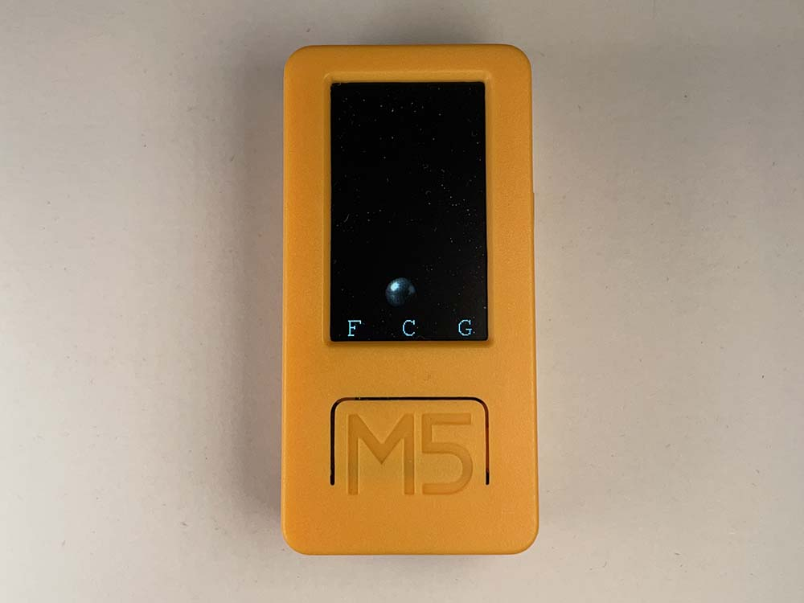
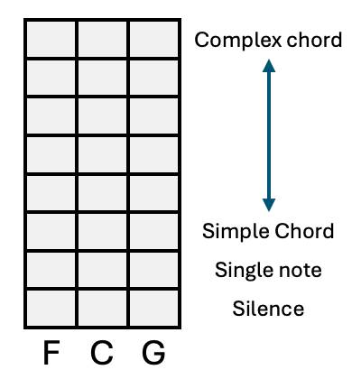
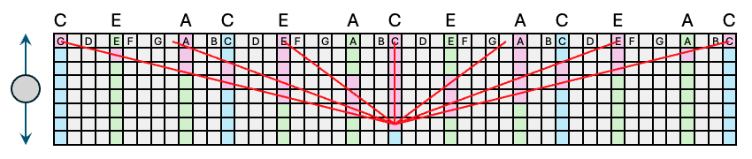
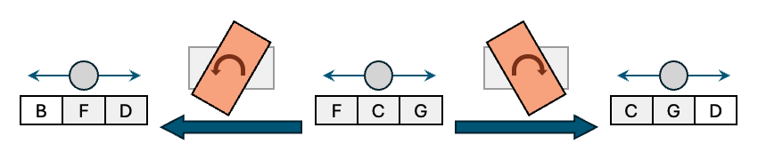

# Ensemble : Bluetooth MIDI performance device

[🇯🇵 日本語はこちら](README_ja.md)

Play an Ensemble of Bluetooth-Connected MIDI Devices Using the M5StickC PLUS2.

### Key Features
- Sends MIDI data over Bluetooth based on a key pitch
- Controls the timbre with movements like rolling a ball in a bowl
- The ball’s forward-backward position expands from a single key note to complex chords
- The ball’s left-right position plays chords a perfect fifth above or below the key note

### Hardware
- M5StickC PLUS2

### Setup
This ensemble uses the tilt of the M5StickC PLUS2 to send MIDI over Bluetooth. It does not generate sound directly, so to perform music, you need a sound module that can receive MIDI via Bluetooth.
For example, iOS GarageBand supports BLE MIDI and can be connected to Ensemble as an input device for playing music.

### Chord Structure
The ball on the screen simulates a bowl-like curved surface. It is pulled toward the center in the left-right direction and toward the frontmost area in the forward-backward direction.
By tilting the M5StickC PLUS2, the ball rolls across the screen, and its position changes the timbre and pitch.

The screen is virtually divided into a 3 (left-right) × 8 (forward-backward) grid.
- The frontmost area is silent
- The second row plays only the key note
- As the ball moves further back, the chord expands with higher and lower tones
- In the backmost row, a 7-note chord is played, evenly distributed across four octaves

Conceptually, a line is drawn connecting the central point in the second row with a point representing 7 notes evenly spaced over 4 octaves in the backmost row.
Each row plays chords approximating the line passing through those points.

The left-right direction changes the key pitch:
- The right area plays a chord a perfect fifth above
- The left area plays a chord a perfect fifth below

If you tilt the M5StickC PLUS2 significantly to the right, the pitch range of each area shifts leftward, and the rightmost area adds a chord a fifth above the previous top pitch.

At startup, the center area is set to C major.
Pressing the button at the bottom of the screen toggles between major and minor, switching to C minor.

### Stopping the Sound
Sometimes, while playing, the sound may not stop and continues to play.
In that case, pressing the power button will stop all sounds.

