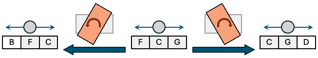

# Ensemble

[🇺🇸 English version here](README.md)

M5StickC PLUS2を使用して、Bluetoothで接続したMIDI機器のアンサンブルを演奏します。

### 主な特徴
- キーになる音程を元にBluetoothでMIDIデータを送出
- お椀にボールを入れたような動きで、音色をコントロール
- ボールの前後の位置によって、キーの音のみから複雑な和音へと展開
- ボールの左右の位置によって、キーの音の５度上下の和音を演奏

### ハード構成
- M5StickC PLUS2

### セッティング
このEnsembleはM5StickC PLUS2の傾きによってBluetoothでMIDIを送出する機能を持ちますが、直接音を出すわけではないので、演奏のためには、BluetoothでMIDIを受信できる音源が必要です。
例えば、iOSのGarageBandはBLE MIDIに対応していますので、Ensembleを入力機器として接続して演奏することができます。

### 和音の構造
画面上のボールは、お椀のような曲面をシミュレートしていて、左右方向では中央に向けてひっぱられ、前後方向では、一番手前に向けてひっぱられるようになっています。そこで、M5StickC PLUS2を傾けることでボールを転がし、その位置によって音色や音程を変化させるようになっています。

画面は仮想的に左右方向3×前後方向8のグリッドに分割されています。
- 最前列のエリアは無音です。
- 2列目ではキーの音のみが演奏されます。
- ボールが奥に移動するにつれて、高音や低音が加わり、和音が広がっていきます。
- 一番奥の列では、4オクターブに均等に配置された7音の和音が演奏されます。

概念的には、2列目の中央の点と、最奥列にある4オクターブに均等に配置された7つの音を表す点を結ぶ線が引かれ、その線に近い和音が各列で演奏されるようになっています。

横方向はキーの音程が変わるようになっており、中央の音程に対して、右のエリアは５度上、左のエリアは５度下になっています。
M5StickC PLUS2を大きく右に傾けると、各エリアの音程が一つ左のエリアに移動し、一番右にはさらに５度上野音程が現れます。

起動した状態では、中央のエリアがCメジャーになっていますが、画面下のボタンを押すと、メジャー／マイナーを切り替え、Cマイナーに変わります。

### 音の停止
演奏している時に、音が止まらず鳴りっぱなしになることがあります。その時はパワーボタンをクリックすることで全ての音を止めることができます。

